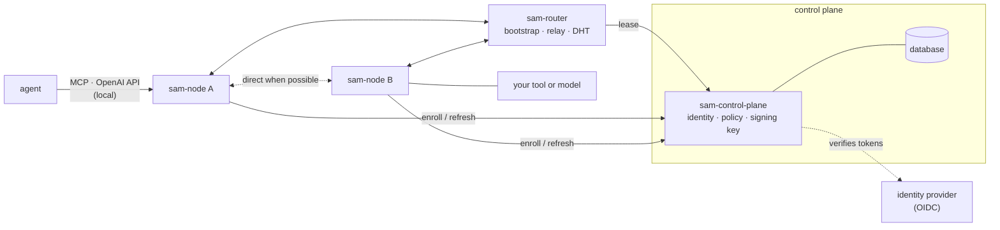

An agent mesh has a small control plane, one or more routers, and any number
of nodes. The control plane decides who is in the mesh and what they may do.
Routers make the nodes reachable. Nodes do the work: they publish services
and call each other's services on behalf of the agents next to them.

## The control plane

`sam-control-plane` is an HTTP service backed by SQLite or PostgreSQL. It is
the only component that has to be trusted. It is not on the data path: tool
calls and model requests never pass through it.

It has four jobs:

- **Admitting nodes.** A node presents an OpenID Connect token from the
  configured identity provider, or a bootstrap token minted by an operator,
  together with proof that it holds the private key it is registering.
- **Issuing credentials.** For each admitted node, the control plane mints a
  [Biscuit](https://www.biscuitsec.org/): a signed token that carries the
  node's peer ID, its roles, the identity facts from the login (user, email,
  groups), the labels it was allowed to declare, and the grants its roles
  give it. Nodes verify these tokens offline with the control plane's public
  key.
- **Holding the mesh policy.** Roles and bindings are edited through the
  admin API or the console, and nodes read them on a schedule.
- **Tracking routers.** Routers hold short leases. A new node fetches the
  list of live routers from `/info` before it connects to anything.

The control plane also rotates its signing key, keeps a ban list, and serves
the public keys that nodes need to verify their peers. [Identity](../identity/)
covers all of that.

## Routers

`sam-router` is a libp2p peer with a stable address. It runs the mesh's
Kademlia DHT (a distributed hash table), where nodes advertise their services
and look up who provides what. It also relays traffic for nodes that cannot
accept inbound
connections. A router has no policy of its own. It verifies every peer's
credential and refuses peers it cannot verify and peers that have been
banned.

Routers keep no state apart from their key file, which fixes their peer ID.
You can run any number of them. Nodes learn about them from the control plane
and connect to the ones that answer.

## Nodes

`sam-node` runs as one process per host or per pod, next to the service it
serves or the agent that uses it. On the mesh side it is a libp2p peer with
its own Ed25519 key. Its peer ID is derived from that key, and every other
component refers to the node by that ID.

Towards the mesh, a node:

- publishes the services declared in its configuration file (MCP servers,
  OpenAI-compatible inference backends, A2A agents) to the DHT and, on
  request, to the control plane's catalog
- accepts connections from other nodes, verifies their credential, evaluates
  policy for the requested service, and proxies the request to the local
  backend if the check passes
- verifies the credential of every node it calls, so that a caller can
  require properties of a provider (its labels, for example) before sending
  any data

Towards the agent, a node exposes a local API on `127.0.0.1:8080` by default
and on a Unix socket. The API includes an MCP server whose tools discover and
call services across the mesh, an OpenAI-compatible `/v1` endpoint that
routes model requests to inference providers on the mesh, and a proxy path
`/sam/<peer-id>/<type>/<name>/` that reaches a specific service directly.
The proxy path is also how an agent talks to another agent over A2A: a
standard A2A client points at it, and the node rewrites the agent card so
that the client stays on the mesh. [Networking](../networking/) describes
the API and how traffic moves.

## Names instead of addresses

A service is identified by type and name: `mcp://code-reviewer`,
`inference://vllm-eu`, `a2a://triage`. Policy grants are written against
these names, discovery returns them, and the node that hosts a service
decides whether a caller may use it. IP addresses do not appear in policy.
Because of this, a node can move between networks or sit behind NAT without
any rule changing.

## Where decisions are made

| Decision | Made by | Based on |
|---|---|---|
| May this identity join, with this role and these labels? | control plane, at enrollment | OIDC token or bootstrap token, mesh policy bindings, `allowed_labels` |
| Is this peer's credential genuine and current? | every node and router, on every connection | control plane public keys, expiration, ban list |
| May this caller use this service? | the node hosting the service | grants in the caller's credential, the synced mesh policy, the host's own local rules |
| Is this provider acceptable to me? | the calling node, before sending data | the provider's credential and attested labels |

Every one of these decisions is deny by default. A new control plane with
no policy admits nodes but grants them nothing, and a node with no services
configured publishes nothing. [Authorization](../authorization/) explains
the policy model.

## Trust boundaries

The control plane is the trust root. Whoever controls it controls who is in
the mesh and what the policy says. A node refuses to fetch its trust root
over plaintext from a remote address, so a control plane URL must use
`https://` unless the control plane runs on the same host.

Routers see connection metadata and relay encrypted streams. They cannot
read relayed traffic and cannot mint credentials. A compromised router can
deny service but cannot grant access.

Nodes trust each other only as far as a verified credential says. The node
that hosts a service has the final say over who calls it, even beyond what
the control plane granted: its local configuration can add conditions that
the caller's credential must also satisfy.

## Packaging

The same three programs ship in several forms:

- **Binaries** for Linux, macOS and Windows, from the releases page or the
  install script.
- **Container images**: `ghcr.io/google/sam-control-plane`,
  `sam-router`, `sam-node`, `sam-console` and `sam-one`.
- **`sam-one`**, a single binary that runs the control plane, a router and
  the console in one process on one port, for laptops, Cloud Run and small
  meshes.
- **Helm charts**: `sam-mesh` deploys the control plane, router, console and
  PostgreSQL. `sam-node` deploys a node beside a service container.

The web console (`sam-console`) is a separate program that talks to the
control plane's admin API. It is not required to run a mesh.
